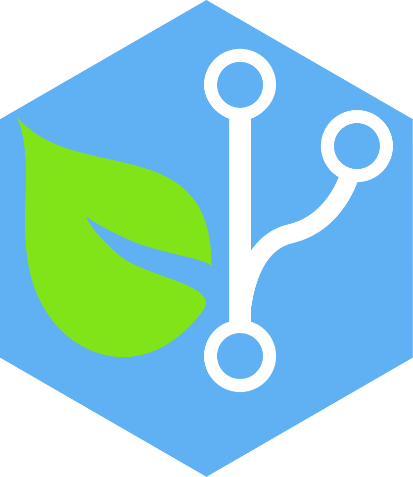

# Biogit

> Biogit, the modern framework for scientific research

## Setup overview

The web app is build with [vue](https://vuejs.org/) and [vuex](https://vuex.vuejs.org/en/intro.html)
on the front end. We follow the philosophy of those frontend frameworks
when writing code.

The API for querying data is hosted on the backend by [graphcool](https://www.graph.cool/).

The API follows the [GraphQL standard](http://graphql.org/) where we define
our data model in a `.graphql` file using the GraphQL language. (This is located in a another repo)

We then use the graphcool CLI to deploy the API quickly (it's a serverless setup).
The data model can be visualised in the graphcool web GUI (and you can try out queries).

We highly recommend getting familiar with those frameworks before contributing to this project,
but here's a quick TL;DR:

The graphcool files are in a separate private repo, email m.bautzer@biogit.me for access.

We use VueX to query for data and manage the state of the app.
The VueX functions are in the `~/src/store` directory.
We use those functions in Vue components to populate them with the relevant data.
The Vue framework is able to track the variable and efficiently update their values
in the DOM.

## Build Setup

The app was bootstrapped with the vue webpack template

``` bash
# install dependencies
npm install

# serve with hot reload at localhost:8080
npm run dev

# build for production with minification
npm run build

# build for production and view the bundle analyzer report
npm run build --report
```

For a detailed explanation on how things work, check out the [guide](http://vuejs-templates.github.io/webpack/) and [docs for vue-loader](http://vuejs.github.io/vue-loader).
